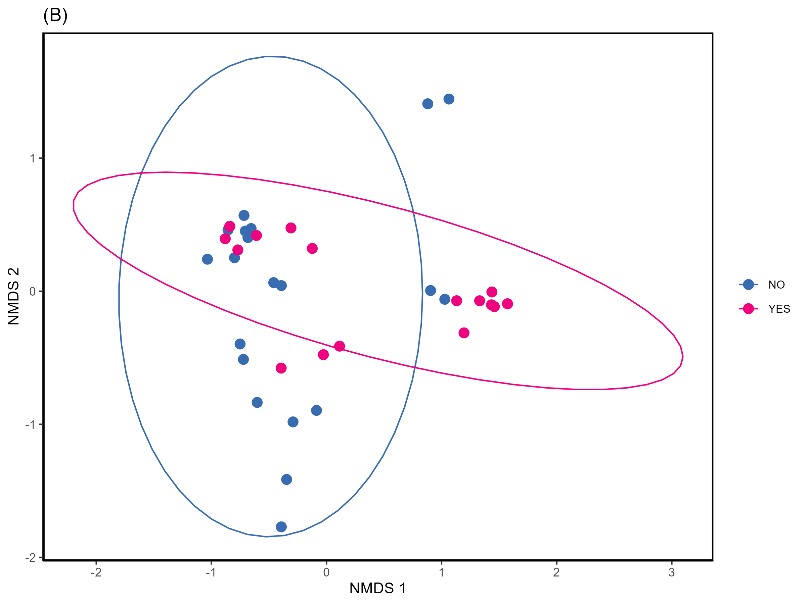

# Impact of Contact Lenses and Pollen Allergies on the Ocular Surface Microbiome

**Master's Thesis** | Universities of Fribourg and Bern | August 2025  
*By Oriane Solange Kopp*  
*Under supervision of Dr. phil. Denise Corinne Zysset-Burri, PhD*

## 🔬 Abstract

This study investigates how contact lens wear and pollen allergies impact the ocular surface microbiome (OSM) and tear proteome using whole-metagenome shotgun sequencing (WMSS) and nano liquid chromatography tandem mass spectrometry (nLC-MS/MS).

### Key Findings
- **Contact Lenses**: No significant differences in microbial composition or tear proteome between contact lens wearers and controls, though sex-specific responses and duration effects were observed
- **Pollen Allergies**: Significant association with *Moraxella osloensis*, representing a potential novel therapeutic target
- **Methodology**: Developed and validated decontamination methods for low-biomass microbiome studies

## 🎯 Study Objectives

1. **Microbiome Analysis**: Characterize OSM in contact lens wearers and pollen allergy sufferers vs. controls
2. **Proteome Profiling**: Analyze tear proteome differences between study populations
3. **Clinical Assessment**: Evaluate dry eye disease (DED) parameters and their relationship with OSM
4. **Methodological Innovation**: Implement decontamination methods for OSM contamination challenges

## 📊 Study Design

### Cohorts
- **Contact Lens Study**: 25 wearers vs. 23 age-/sex-matched controls
- **Pollen Allergy Study**: 18 allergy sufferers vs. 21 age-/sex-matched controls

### Methods
- **Sequencing**: Illumina NovaSeq 6000, 150bp paired-end reads
- **Analysis Pipeline**: MetaPhlAn4 for taxonomy, HUMAnN3 for function
- **Proteomics**: nLC-MS/MS with FragPipe/MSFragger processing
- **Statistics**: MaAsLin2, PERMANOVA, machine learning (Random Forest, SVM)

## 🧬 Key Results

### Contact Lenses


- No significant overall differences in OSM composition or diversity
- Sex-stratified analysis revealed marginal differences in male participants
- Duration of wear showed significant association with OSM composition
- Increased subjective dry eye symptoms (OSDI©) in female contact lens wearers but otherwise no significant differences

- No differences in tear proteome composition

- Machine Learning models were not able to distinguish contact lens wearers from controls


### Pollen Allergies


- Significant differences in OSM beta diversity (p = 0.007)
- ***Moraxella osloensis* significantly more abundant** in pollen allergy sufferers (q = 0.025)

- No differences in tear proteome composition


### Methodological Contributions
- Novel decontamination approach: **decontam + PubMed** method
- Comparison of multiple contamination removal strategies

## 🔧 Technical Implementation

### Decontamination Pipeline
```
Raw Data (from MetaPhlan4) → Decontam Analysis → Contextual Filtering (PubMed) → Clean Dataset
```

### Key Software & Packages
- **Sequencing**: UMI-tools, fastp, Bowtie2, SAMtools
- **Microbiome**: MetaPhlAn4, HUMAnN3, MaAsLin2, decontam
- **Proteomics**: FragPipe, MSFragger, IonQuant, DAVID bioinformatics
- **Statistics**: R (vegan, ggplot2, randomForest, e1071)

## 📁 Repository Structure

```
├── scripts/
│   ├── 1_decontamination_functions.R
│   ├── 2_analysis_functions.R
│   ├── 3_DED_score_functions.R
│   └── 4_protein_analysis.R
├── results/
│   └── ...

```
Those scripts are jsut snipnets of the scripts created during this project. Don't hesitate to contact me if you want to learn more. 

## 🔬 Clinical Implications

### Contact Lenses
- Well-adapted contact lens wearers may not show significant microbiome disruption
- Sex-specific responses warrant further investigation
- Duration effects suggest long-term monitoring may be beneficial

### Pollen Allergies
- ***M. osloensis* as potential therapeutic target**
- Microbiome-based approaches for allergy treatment
- Novel diagnostic biomarker possibilities

## ⚠️ Limitations & Future Directions

### Study Limitations
- Small sample sizes for subgroup analyses
- Low microbial biomass challenges

### Future Research
- Larger longitudinal cohorts
- Investigation of *M. osloensis* therapeutic targeting
- Contact lens material and hygiene practice effects
- Seasonal variation in pollen allergy microbiome

## 📚 Publication

*Publication currently under review*

## 🙏 Acknowledgments

Special thanks to Dr. Denise C. Zysset-Burri for supervision, and the early project team including Sophia C. Morandi, Marco Kreuzer, and Anne-Christine Uldry.
